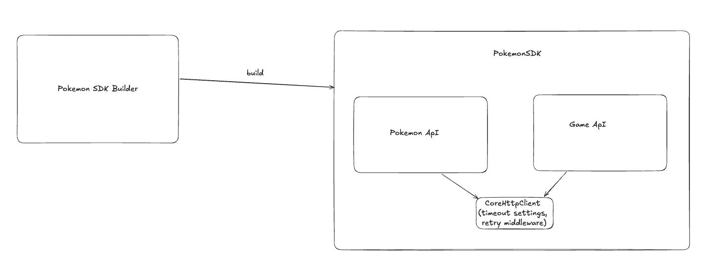

# Pokemon API SDK
This SDK exposes `PokemonSdk` which can be used to call different group of Apis present on  [Pokemon API website](https://pokeapi.co/docs/v2)

[Pokemon API website](https://pokeapi.co/docs/v2) exposes api under different groups
- Games
- Item
- Pokemon
- etc...

Currently the SDK only supports fetching a specific `Pokemon` from the `Pokemon Group` and a specific `Generation` from the `Games Group`.

# How to use
1. In order to initiate `PokemonSdk` we need to first construct a `PokemonSdkBuilder`. `PokemonSdkBuilder` is used to generate `PokemonSdk`.
2. `PokemonSdkBuilder` has various methods to alter different configurations. Eg change baseURL, http client to use (http client has details such as timeout), retry strategy on transient errors 
3. After making changes to `PokemonSdkBuilder` the final step is to call `build()` on `PokemonSdkBuilder`. This returns a `PokemonSdk`.
4. `PokemonSdk` can be used to fetch pokemon details. Eg `PokemonSdk.pokemon().pokemon_details("Pikachu")`

# Architecture
